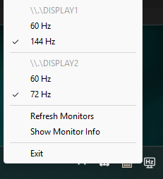

# Windows Refresh Rate Switcher

### Python system tray application to switch your monitor refresh rate with just two clicks

## Features

### Profiles for Refresh Rates
- Save up to **three custom profiles** for monitor refresh rates.
- Quickly switch between profiles using hotkeys:
  - `Ctrl + Alt + 1` for **Profile 1**
  - `Ctrl + Alt + 2` for **Profile 2**
  - `Ctrl + Alt + 3` for **Profile 3**

### Exclude Unwanted Refresh Rates
- **Hide refresh rates** you don’t use from the main tray menu.
- Easily toggle excluded rates through the **"Options" submenu** in the system tray.
